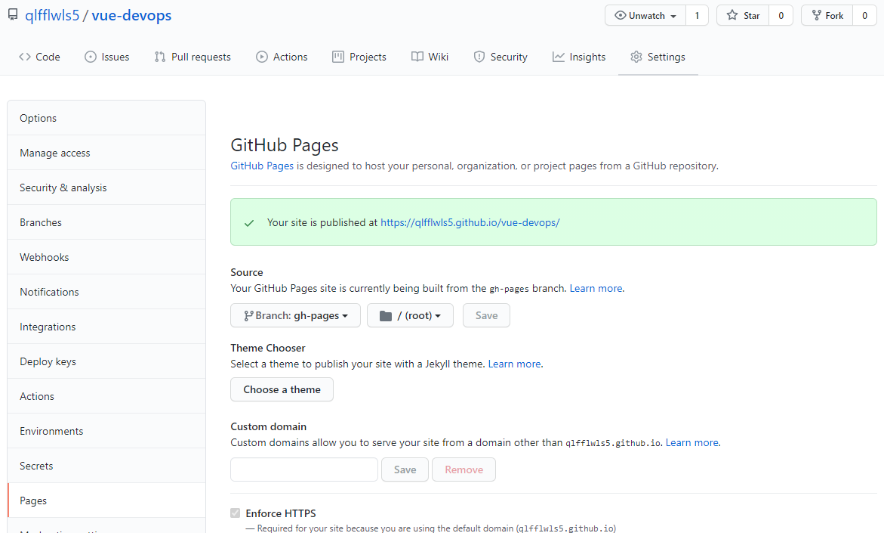

# vue-devops

<br/>

## Project setup
```
yarn install
```

### Compiles and hot-reloads for development
```
yarn serve
```

### Compiles and minifies for production
```
yarn build
```

### Run your unit tests
```
yarn test:unit
```

### Lints and fixes files
```
yarn lint
```

### Customize configuration
See [Configuration Reference](https://cli.vuejs.org/config/).

<br/>

<br/>

## Vue CLI 프로젝트 기반 DevOps 개발환경 실습

<br/>

<br/>

## 목차

+ [Vue 프로젝트 생성 및 로컬 실행 확인](#1-vue-프로젝트-생성-및-로컬-실행-확인)
  + [사전 환경 구성](#11-사전-환경-구성)
  + [Vue 프로젝트 생성](#12-vue-프로젝트-생성)
  + [yarn serve 실행 웹 브라우저 확인](#13-yarn-serve-실행-웹-브라우저-확인)
+ [GitHub에 코드 Push 및 Pages에 수동 배포](#2-github에-코드-push-및-pages에-수동-배포)
  + [GitHub에 vue-devops 프로젝트 생성](#21-github에-vue-devops-프로젝트-생성)

  + [원격 저장소 설정 및 코드 푸시하기](#22-원격-저장소-설정-및-코드-푸시하기)

  + [GitHub Pages로 배포하기 위한 라이브러리 추가 및 package.json에 배포에 필요한 정보 추가](#23-github-pages로-배포하기-위한-라이브러리-추가-및-packagejson에-배포에-필요한-정보-추가)

  + [배포용 publicPath 설정](#24-배포용-publicpath-설정)
  + [yarn deploy 및 gh-pages 브랜치 생성 후 푸시](#25-yarn-deploy-및-gh-pages-브랜치-생성-후-푸시)
  + [설정에서 배포된 주소 확인 및 접속](#26-설정에서-배포된-주소-확인-및-접속)
+ [GitHub Actions workflow로 배포 자동화](#3-github-actions-workflow로-배포-자동화)
  + [Simple workflow 파일 작성 및 커밋](#31-simple-workflow-파일-작성-및-커밋)
  + [IDE sync](#32-ide-sync)
  + [deploy.yml 수정](#33-deployyml-수정)
+ [코드 수정 및 테스트 실패로 인한 자동 배포 실패 확인](#4-코드-수정-및-테스트-실패로-인한-자동-배포-실패-확인)
+ [코드 재수정 및 배포 성공 확인](#5-코드-재수정-및-배포-성공-확인)
+ [TIL](#6-til)

<br/>

<br/>

## 1. Vue 프로젝트 생성 및 로컬 실행 확인

### 1.1 사전 환경 구성

> Node.js 설치 상태 가정
>
> https://classic.yarnpkg.com/en/docs/install#windows-stable

+ cmd 혹은 bash창을 통해 yarn 설치

```
npm install --global yarn
```

+ 설치 확인

```
yarn --version
```

+ Vue CLI 설치

```
yarn global add @vue/cli
```

+ 버전 확인

```
vue -V
```

<br/>

### 1.2 Vue 프로젝트 생성

+ IDE(작성자는 VS code에서 진행했다.)에서 bash 창을 통해 프로젝트 생성 과정 진행
  + 단순 git bash에서 진행 시 옵션 선택 이동 불가

```bash
vue create vue-devops
```

+ 옵션 1. Manually select features 선택
+ 옵션 2. Unit Testing을 spacebar로 추가 후 enter
+ 옵션 3. 3.x 선택
+ 옵션 4. ESLint + Prettier 선택
+ 옵션 5. Lint on save 선택
+ 옵션 6. In dedicated config files 선택
+ 옵션 7. N 선택
+ 추가 옵션 8. yarn 선택(yarn과 npm 중에 골라야 할 경우)


<br/>

### 1.3 yarn serve 실행 웹 브라우저 확인

```
yarn serve
```

+ 실행 후 웹 브라우저에서 화면 확인
  + `http://localhost:8080/`가 기본 주소로 되어 있다.
+ 웹 브라우저 화면


<br/>

<br/>

## 2. GitHub에 코드 Push 및 Pages에 수동 배포

### 2.1 GitHub에 vue-devops 프로젝트 생성

+ GitHub에서 새로운 repository 생성


+ 다음과 같이 repository name 지정 후 public으로 생성


<br/>

### 2.2 원격 저장소 설정 및 코드 푸시하기

+ bash창에서 생성한 repository로 원격 저장소를 설정해주고 init 코드를 push한다.


<br/>

### 2.3 GitHub Pages로 배포하기 위한 라이브러리 추가 및 package.json에 배포에 필요한 정보 추가

```
yarn add gh-pages -D
```


+ package.json파일의 내용에 homepage 추가, scripts 내에 predeploy, deploy, clean 부분 추가

```json
{
  "name": "vue-devops",
  "version": "0.1.0",
  "private": true,
  "homepage": "https://qlfflwls5.github.io/vue-devops",
  "scripts": {
    "serve": "vue-cli-service serve",
    "build": "vue-cli-service build",
    "predeploy": "vue-cli-service build",
    "deploy": "gh-pages -d dist",
    "clean": "gh-pages-clean",
    "test:unit": "vue-cli-service test:unit",
    "lint": "vue-cli-service lint"
  },
    ...
```

<br/>

### 2.4 배포용 publicPath 설정

+ 프로젝트 최상단에 vue.config.js 파일을 생성하고 다음 코드 입력
  + vue-devops 대신 github아이디.github.io 이름으로 GitHub Pages 대표 repository를 만들었다면 이 과정이 필요 없지만, 다른 용도로 쓰고 있음을 가정하여 별도 하위 publicPath를 이용

```js
module.exports = {  publicPath: "/vue-devops/",  outputDir: "dist"}
```

<br/>

### 2.5 yarn deploy 및 gh-pages 브랜치 생성 후 푸시

```bash
yarn deploy
```


+ 원격 저장소의 gh-pages 브랜치를 생성하며 푸시하게 됨

<br/>

### 2.6 설정에서 배포된 주소 확인 및 접속



+ 주소로 들어가면 Vue 페이지를 볼 수 있음

<br/>

<br/>

## 3. GitHub Actions workflow로 배포 자동화

### 3.1 Simple workflow 파일 작성 및 커밋

+ Actions - Set up this workflow 클릭
+ 아래와 같이 진행


+ 커밋과 동시에 샘플 workflow가 동작함을 확인
+ 이후 github의 Actions에서 모든 workflow를 확인

<br/>

### 3.2 IDE sync

```bash
git pull origin master
```

+ deploy.yml 파일을 로컬에도 받기 위해 pull 진행

<br/>

### 3.3 deploy.yml 수정

+ 배포 스크립트인 workflow 파일(deploy.yml)의 jobs 내용을 다음과 같이 수정


+ git add, commit, push 진행

<br/>

<br/>

## 4. 코드 수정 및 테스트 실패로 인한 자동 배포 실패 확인

+ yarn install, yarn build 사이에 단위 테스트 step 추가


+ 테스트가 실패하도록 h1태그 값을 다음과 같이 수정
  + App.vue에서 전달한 props data를 사용해 렌더링 하지 않아 HelloWorld.vue 컴포넌트 테스트가 실패함


+ git add, commit, push 진행
+ Actions에서 자동 배포가 실패했는지 확인


<br/>

<br/>

## 5. 코드 재수정 및 배포 성공 확인

+ 단위 테스트가 실패하면 다음 build, deploy같은 step이 진행되지 않아 배포된 사이트에 문제가 발생하지 않는다. 이처럼 컴포넌트의 작성이나 변경 시 테스트 코드를 꼭 넣어보는 것이 좋다.
+ 이제 HelloWorld.vue를 이전으로 되돌리고 테스트 통과 후 배포가 되었는지를 확인할 수 있도록 자유롭게 내용을 변경해서 add, commit, push를 진행한다.

<br/>

<br/>

## 6. TIL

+ 굉장히 복잡하지만 DevOps를 경험하기 위해 Vue를 빠르게 배포하고 해당 내용을 GitHub Pages로 확인할 수 있는 실습을 해보았다.
+ 수업에는 배우지 못한 배포의 내용을 배워서 좋았고, 이 기능을 사용하면 앞으로 진행할 프로젝트에서도 빠르게 내 작업물이 어떻게 실제 클라이언트에게 보여지는지 확인할 수 있을 것 같다. 특히, 백엔드가 완성되지 않은 상황에서 프론트엔드 작업을 진행할 때에 빠르게 테스트를 하는 용도로 좋을 것 같다.
